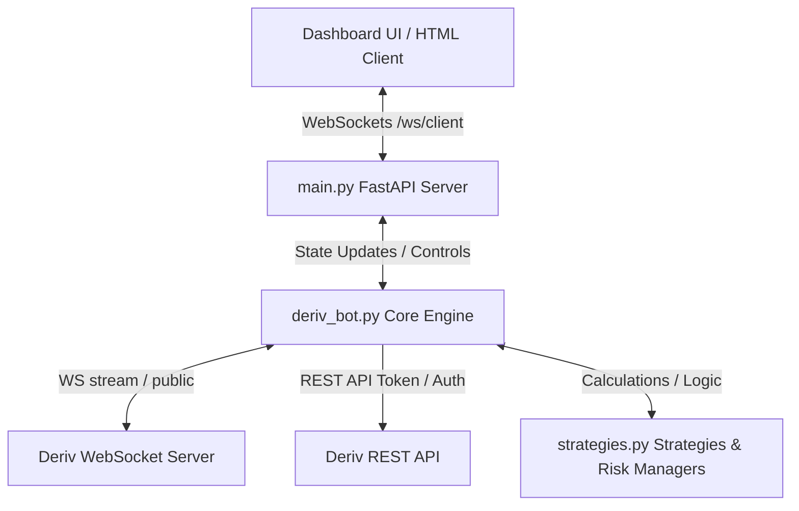

# 🌌 Antigravity Deriv Auto-Trading Bot

[](https://www.python.org/)
[](https://fastapi.tiangolo.com/)
[](https://websockets.readthedocs.io/)
[](https://api.deriv.com/)
[](https://opensource.org/licenses/MIT)

An ultra-premium, asynchronous automated trading bot engineered for the **Deriv** platform. It features an interactive, stunning **Glassmorphism Dashboard** styled with custom vanilla CSS and powered by real-time WebSocket communication. 

The trading engine is built from the ground up to analyze live 1-minute candlestick feeds and execute contract buys via a dual-step proposal-purchase cycle. It now focuses on a single ML-powered pattern engine and **5 advanced mathematical risk management models** that can be updated on-the-fly without restarting the system.

> [!WARNING]
> **Financial Risk Disclaimer:** Automated trading carries high risk. It is strongly recommended to run the bot exclusively in **Demo Mode** with virtual funds until you have verified your strategy and money management settings over a statistically significant number of trades.

---

## 📸 Dashboard & Interface

The dashboard is styled with modern design aesthetics:
- **Glassmorphic Panels:** Modern frosted-glass containers with subtle borders and heavy backdrops (`backdrop-filter`).
- **Dynamic Background Blobs:** Dual animated purple and blue radial gradient glow objects drifting slowly behind panels.
- **Micro-Animations:** Fluid interactive hover states, pulse indicators for server states, and sliding transitions.
- **Double Visualization Chart:** Switch instantly between real-time **1-Minute Candlestick Charts** and **Tick Line Charts**.
- **ML Pattern Telemetry:** Displays discovered pattern names, model confidence, and walk-forward backtest summaries.
- **Live CLI-like Console:** A retro-green retrofitted developer feed printing real-time bot operations, socket heartbeats, API responses, and trade status updates.

---

## 🚀 Key Features

- ⚡ **Full Asynchronous Lifecycle:** Built entirely using `asyncio` for non-blocking network streams, REST requests, and WebSocket subscriptions.
- ⚙️ **Hot-Reloadable Configurations:** Modify stake sizes, strategy parameters, money management methods, and safety limits instantly through the UI without stopping the backend engine.
- 🔒 **Secure OTP Authentication:** Dynamic redirection routing. Exposes your API token only to fetch secure One-Time Passwords (OTP) from Deriv, routing the WebSocket stream via authorized single-session tokens.
- 📈 **Pattern Discovery and ML Modeling:** Candle-sequence feature extraction, sequence classification, and pattern clustering for short-term trading.
- 🔄 **Automatic Reconnection & Backoff:** Detects socket dropouts or rate-limiting (e.g., Cloudflare 1015, HTTP 429) and performs graceful cooling backoffs (up to 30 seconds) before re-establishing feeds.
- 📊 **Drawdown Tracking:** Live analysis of session peaks, real-time cash drawdowns, and maximum percentage drawdowns.

---

## 🛠️ Project Architecture



The codebase is modular and cleanly separated:

- **[`main.py`](file:///c:/Users/Teja/Desktop/po_bot/main.py):** FastAPI backend and static page server. Controls the local WebSocket server to communicate with the browser client. Contains CLI lifecycle helpers to cleanly write and clean up process IDs (`server.pid`) for background execution.
- **[`deriv_bot.py`](file:///c:/Users/Teja/Desktop/po_bot/deriv_bot.py):** The heart of the bot. Manages WebSocket connections to Deriv, handles OTP generation, maintains rolling candlestick caches, listens for candle closes, and executes trades asynchronously.
- **[`storage.py`](file:///c:/Users/Teja/Desktop/po_bot/storage.py):** SQLite persistence layer for candle history, trade history, model runs, and backtest summaries.
- **[`strategies.py`](file:///c:/Users/Teja/Desktop/po_bot/strategies.py):** Strategy factory plus risk management modules.
- **[`config.py`](file:///c:/Users/Teja/Desktop/po_bot/config.py):** Application settings loader. Grabs token, app ID, port, and default parameters from `.env` or standard system defaults.
- **[`templates/index.html`](file:///c:/Users/Teja/Desktop/po_bot/templates/index.html):** Frost-glass dashboard UI. Visualizes market data, displays ML telemetry, controls options, and renders completed trades.

---

## 📊 Supported Trading Strategies

| Strategy | Description | Key Parameters | Buy Signal (CALL/UP) | Buy Signal (PUT/DOWN) |
| :--- | :--- | :--- | :--- | :--- |
| **ML Pattern Engine** | Trains a local sequence classifier on Deriv candle history and clusters recurring short-term patterns. | `ml_window_size`, `ml_buy_threshold`, `ml_sell_threshold` | Model predicts upward next-candle probability above the buy threshold and the discovered pattern is historically strong. | Model predicts downward next-candle probability below the sell threshold and the discovered pattern is historically strong. |

---

## 💰 Supported Risk & Money Management Systems

You can select from **5 money management models** to automatically scale your stakes based on preceding outcomes:

1. **Flat Stake (Flat):** Always trades the base stake size. Safe, steady, and recommended for standard live testing.
2. **Classic Martingale:** Multiplies the stake size on a loss (using `martingale_multiplier`) to recover all losses in a single win. Includes a `martingale_max_steps` cap to reset to the base stake and prevent total account wipeout.
3. **Fibonacci Progression:** Follows the Fibonacci sequence ($1, 1, 2, 3, 5, 8, 13...$). On a loss, it advances 1 step. On a win, it retreats 2 steps. This linear progression recovers losses over multiple wins without compounding risk as rapidly as Martingale.
4. **D'Alembert:** Increments the stake size by a fixed increment unit on a loss, and decrements by a fixed unit on a win (down to the minimum base stake). Steady, highly stable recovery model.
5. **Oscar's Grind:** Trades in structured cycles targeting exactly $+1$ unit of net profit. The stake remains the same on losses, and increases by $1$ unit on wins—but is scaled down if the next trade would exceed the cycle profit target. Resets the cycle once the target is achieved.

---

## ⚙️ Installation & Setup

### 1. Prerequisites
Make sure you have **Python 3.8 or higher** installed on your machine.

### 2. Download and Extract
Clone or extract this repository into your working directory:
```bash
git clone https://github.com/tejasundeep/deriv-auto-trading-bot.git
cd po_bot
```

### 3. Install Dependencies
Install the required asynchronous web, socket, and configuration libraries:
```bash
pip install fastapi uvicorn websockets requests python-dotenv numpy torch python-multipart
```

### 4. Configure Environment Variables
Copy the `.env.example` file to a new file named `.env`:
```bash
cp .env.example .env
```
Open `.env` and fill in your Deriv credentials:
```env
# Replace with your official Deriv API token (Demo token highly recommended)
DERIV_API_TOKEN=your_deriv_api_token_here

# Standard testing App ID is 1089. Replace if using registered Custom App ID
DERIV_APP_ID=1089

# Dashboard Server Settings
PORT=8000
HOST=127.0.0.1
```

---

## 🏃 Running the Bot

The backend contains a Process ID (PID) helper that handles server process lifecycles.

### Starting the Server
Run the FastAPI backend using standard Python:
```bash
python main.py
```
*This starts the server, saves the current process ID into `server.pid`, and hosts the dashboard.*

### Stopping the Server
To gracefully terminate the running server from another terminal or automation script, run:
```bash
python main.py --stop
```
*This locates the process ID in `server.pid`, kills the background process cleanly, and deletes the temporary PID file.*

### Accessing the Dashboard
Open your web browser and navigate to:
```url
http://127.0.0.1:8000
```

### ML Operations
When the strategy is set to `ml_pattern_engine`, the dashboard exposes:
- `Train Model Now` to force a fresh SQLite-backed retrain.
- `Run Backtest` to evaluate the current strategy on stored candle history.
- `Export Candles CSV` and `Export Trades CSV` to download offline data snapshots.
- `Import Candles CSV` and `Import Trades CSV` to restore history into SQLite.
- Sequence and threshold controls for the local ML model in the settings panel.

---

## 🔒 Security & OTP Authentication Flow

Unlike basic bots that pass raw tokens over unencrypted channels, Antigravity uses Deriv's robust secure authentication flow:
1. The bot loads your `DERIV_API_TOKEN` locally.
2. It sends an HTTPS REST request to `https://api.derivws.com/trading/v1/options/accounts` to retrieve accounts.
3. It requests a secure **One-Time Password (OTP)** from `.../otp`.
4. It connects to the WebSocket server using the single-use OTP connection URL.
5. **Your master API token is never transmitted over WebSocket streams**, protecting your credentials.

---

## 🤝 Contributing & Customization

If you want to add your own custom trading strategy:
1. Open [`strategies.py`](file:///c:/Users/Teja/Desktop/po_bot/strategies.py).
2. Create a class that inherits from `BaseStrategy`.
3. Implement `analyze(self, ticks: List[float])` (returning `"CALL"`, `"PUT"`, or `None`).
4. Implement `get_indicators(self, ticks: List[float])` to send telemetry to the dashboard.
5. Register your strategy inside the `get_strategy` factory function at the bottom of the file.
6. Add the option to the `<select id="strategy">` dropdown in [`templates/index.html`](file:///c:/Users/Teja/Desktop/po_bot/templates/index.html).

---

## 📄 License
This project is licensed under the MIT License. See the LICENSE file for details.
